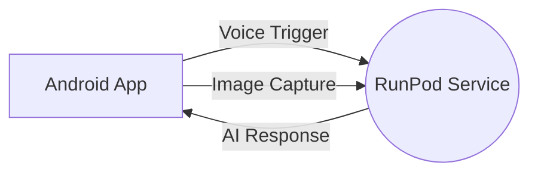

# TalkToApp

A voice-triggered Android application that captures images and communicates with a RunPod AI service to process multimodal inputs (text + image) using the Qwen 2.5 VL model.

## Project Overview

TalkToApp consists of two main components:

1. **Android App**: A Flutter application that:
   - Listens for the trigger phrase "Hey monitor"
   - Captures images from the rear camera
   - Converts voice commands to text
   - Sends the text and image to the RunPod service
   - Converts the AI response to speech

2. **RunPod Service**: A FastAPI application that:
   - Loads the Qwen 2.5 VL model (unsloth/Qwen2.5-VL-3B-Instruct-unsloth-bnb-4bit)
   - Receives multimodal inputs (text + image)
   - Processes them using the Qwen 2.5 VL model
   - Returns text responses to the Android app

## Architecture



## Features

- Voice-triggered operation with "Hey monitor" as the trigger phrase
- Real-time camera image capture
- Speech-to-text conversion
- Multimodal AI processing (text + image)
- Text-to-speech response playback
- Real-time status indicators
- Performance-optimized communication

## Prerequisites

### For Android App:
- Flutter SDK 3.0 or higher
- Android Studio or VS Code with Flutter extensions
- Android device or emulator with camera and microphone

### For RunPod Service:
- Python 3.8 or higher
- CUDA-compatible GPU (recommended)
- Hugging Face account and token (for accessing the Qwen model)

## Setup Instructions

### Android App Setup

1. Navigate to the `android_app` directory:
   ```bash
   cd android_app
   ```

2. Install Flutter dependencies:
   ```bash
   flutter pub get
   ```

3. Connect an Android device or start an emulator

4. Run the app:
   ```bash
   flutter run
   ```

### RunPod Service Setup

1. Navigate to the `runpod_app` directory:
   ```bash
   cd runpod_app
   ```

2. Create a virtual environment:
   ```bash
   python -m venv venv
   source venv/bin/activate  # On Windows: venv\Scripts\activate
   ```

3. Install dependencies:
   ```bash
   pip install -r requirements.txt
   ```

4. Set your Hugging Face token as an environment variable:
   ```bash
   export HF_TOKEN=your_hugging_face_token
   ```

5. Run the service:
   ```bash
   python main.py
   ```

## Usage

1. Launch the Android app
2. Say "Hey monitor" to trigger the app
3. The app will automatically capture an image from the rear camera
4. Speak your query after the image is captured
5. The app sends the image and text to the RunPod service
6. The RunPod service processes the input using Qwen 2.5 VL
7. The response is sent back to the Android app and played as speech

## Performance Optimization

- Image resizing to 512px max dimension for faster processing
- Model loaded once at startup with bnb-4bit quantization
- Single worker configuration for consistent performance
- Timeout mechanisms to prevent hanging requests

## Testing

### Android App Tests
```bash
cd android_app
flutter test
```

### RunPod Service Tests
```bash
cd runpod_app
python -m pytest tests/
```

## Documentation

- [Architecture Details](docs/architecture.md)
- [API Reference](docs/api_reference.md)
- [Android Setup Guide](docs/android_setup.md)
- [RunPod Deployment](docs/runpod_deployment.md)
- [Troubleshooting](docs/troubleshooting.md)
- [Performance Optimization](docs/performance_optimization.md)

## Tutorials

- [Android Installation Guide](tutorials/android_installation_guide.md)
- [RunPod Deployment Tutorial](tutorials/runpod_deployment_tutorial.md)
- [Usage Examples](tutorials/usage_examples.md)

## Scripts

Automated setup scripts are available in the `scripts` directory:
- `setup_android.sh` / `setup_android.bat`: Setup Android development environment
- `setup_runpod.sh` / `setup_runpod.bat`: Setup RunPod service environment
- `run_tests.sh` / `run_tests.bat`: Run all tests
- `setup_venv.sh` / `setup_venv.bat`: Setup Python virtual environment

## Dependencies

### Android App
- Flutter SDK
- speech_to_text
- flutter_tts
- camera
- http
- provider

### RunPod Service
- FastAPI
- PyTorch
- Transformers
- Qwen VL model
- Pillow
- Uvicorn

## Contributing

1. Fork the repository
2. Create a feature branch
3. Commit your changes
4. Push to the branch
5. Create a pull request

## License

This project is licensed under the MIT License - see the [LICENSE](LICENSE) file for details.
